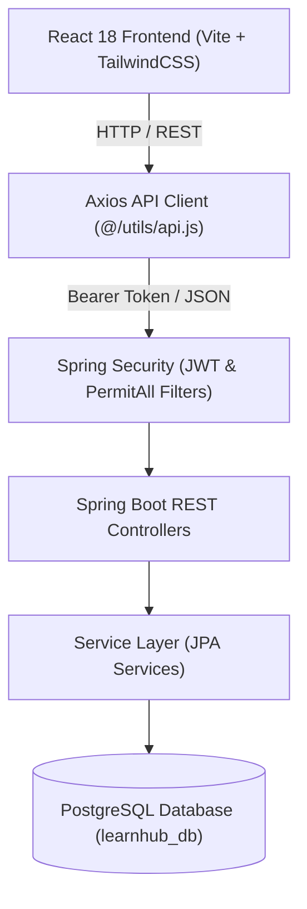
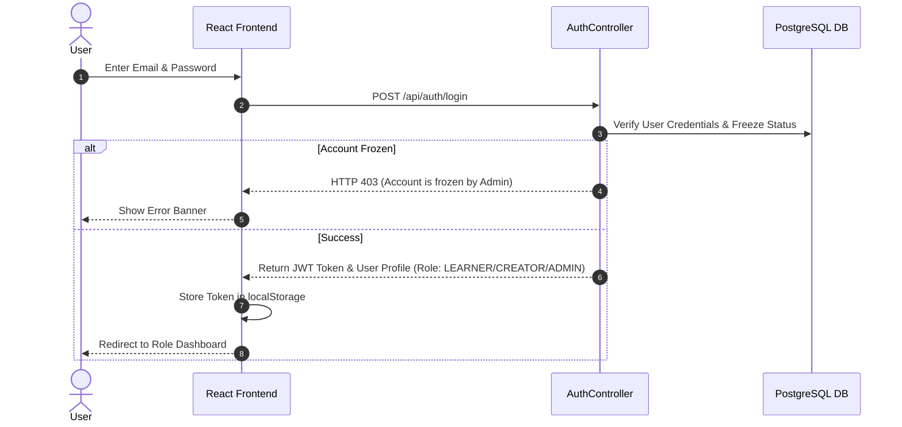
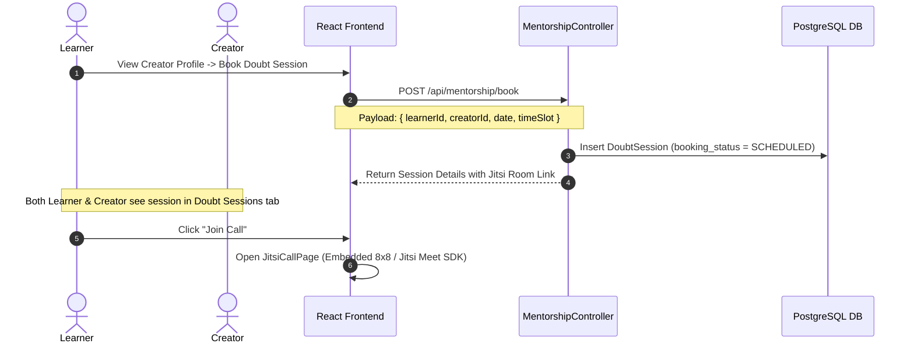

# 🎓 LearnHub — Beginners Handbook & Complete System Workflows

Welcome to the **LearnHub System Handbook**. This guide provides an end-to-end blueprint of the LearnHub platform, detailing full user workflows, architectural data flows, API mappings, and role-based permissions across both the **React Frontend** and **Spring Boot Java Backend**.

---

## 📌 System Architecture Overview



---

## 👥 Role-Based System Workflows

LearnHub supports three distinct user roles: **Learner**, **Creator**, and **Admin**.


---

## 🔄 End-to-End Core Workflows

### Workflow 1: Authentication & Role Switch



---

### Workflow 2: Content Purchasing & Dynamic Revenue Calculation

1. **Browse**: Learner selects a paid resource on the Marketplace (`GET /api/public/contents`).
2. **Checkout**: Learner clicks **Buy Now** -> Navigates to `CheckoutPage.jsx`.
3. **Purchase API**: Frontend calls `POST /api/purchases/buy` with `userId` & `contentId`.
4. **Database Mutation**:
   - Inserts record into PostgreSQL `purchases` table.
   - Increments `learners_count` on `contents` table.
   - Calculates total revenue on Creator side (`SUM(price * learners_count)`).
5. **Access Granted**: Resource appears immediately in **My Library** (`GET /api/user/library`).

---

### Workflow 3: Mentorship Session Booking & Jitsi Video Call



---

### Workflow 4: In-Reader Doubts & Q&A Discussion Forum

1. **Learner Question**:
   - Opens document in `UnifiedContentViewerPage.jsx`.
   - Opens **Doubts & Q&A** side drawer.
   - Submits technical question (`POST /api/qa/question`).
2. **Creator Response**:
   - Creator opens **Management Grid** in Creator Mode.
   - Clicks **💬 Q&A** button next to their uploaded content.
   - Replies to student doubt (`POST /api/qa/thread/{id}/reply`).
3. **Resolution**:
   - Reply is saved with `role = "CREATOR"`.
   - Displays a **Verified Answer** badge and marks thread as **Resolved** (`isResolved = true`).

---

### Workflow 5: Interactive Star Rating & Review System

1. **Submission**: Learner clicks **⭐ Rate Resource** inside Content Reader (`ReviewModal.jsx`).
2. **API Request**: Calls `POST /api/contents/{contentId}/reviews` with rating (1–5 stars) & review text.
3. **Backend Processing**:
   - Inserts record in `reviews` table.
   - Recalculates average rating and review count.
   - Updates `rating` & `reviews_count` on `contents` table in PostgreSQL.
4. **Marketplace Update**: Card reflects updated star rating dynamically.

---

## 🛠️ API Reference Cheat Sheet

| Feature | HTTP Method | Endpoint | Access Rule |
|---|---|---|---|
| **User Login** | `POST` | `/api/auth/login` | Public |
| **User Register** | `POST` | `/api/auth/register` | Public |
| **Marketplace Catalog** | `GET` | `/api/public/contents` | Public |
| **Resource Details** | `GET` | `/api/public/resource/{id}` | Public |
| **Upload Resource** | `POST` | `/api/creator/content` | Creator |
| **Manage Content Status** | `PUT` | `/api/creator/content/{id}/status` | Creator |
| **Buy Resource** | `POST` | `/api/purchases/buy` | Learner |
| **Learner Library** | `GET` | `/api/user/library` | Learner |
| **Book Doubt Session** | `POST` | `/api/mentorship/book` | Authenticated |
| **Get Doubt Sessions** | `GET` | `/api/mentorship/sessions` | Authenticated |
| **Q&A Threads** | `GET` | `/api/qa/content/{contentId}` | Authenticated |
| **Post Question** | `POST` | `/api/qa/question` | Authenticated |
| **Post Reply** | `POST` | `/api/qa/thread/{id}/reply` | Authenticated |
| **Submit Review** | `POST` | `/api/contents/{contentId}/reviews` | Authenticated |
| **Toggle User Freeze** | `PUT` | `/api/admin/users/{id}/freeze` | Admin |

---

## 🚀 How to Run the Complete Stack

### 1. Backend Setup (`project-backend-Java`)
```powershell
# Ensure PostgreSQL database 'learnhub_db' exists on localhost:5432
cd C:\Users\shubh\Desktop\Projects\project-backend-Java

# Compile and start Spring Boot Application
.\mvnw spring-boot:run
```
*Backend runs on **`http://localhost:8080`***

### 2. Frontend Setup (`project-frontend-react`)
```powershell
cd C:\Users\shubh\Desktop\Projects\CDAC-Final-Project\project-frontend-react

# Install dependencies (if needed)
npm install

# Start Vite Development Server
npm run dev
```
*Frontend runs on **`http://localhost:5173`***
