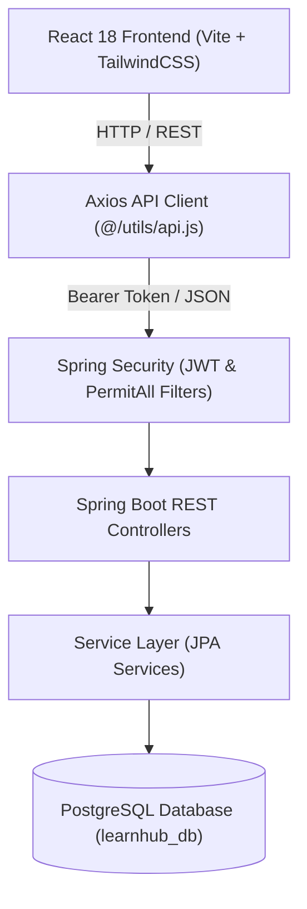
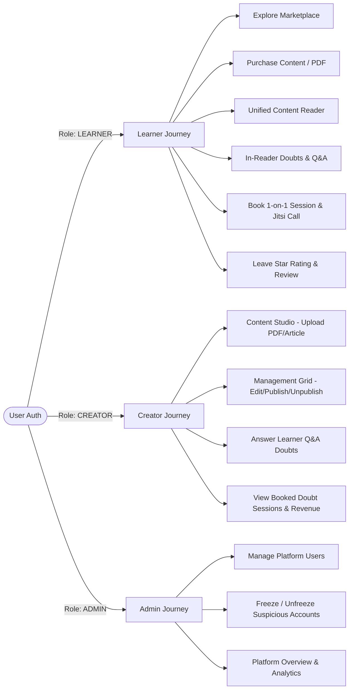

# 📘 LearnHub — Complete User Handbook & Step-by-Step Testing Guide

Welcome to the **LearnHub System Handbook & Testing Guide**. This guide provides an end-to-end blueprint of the LearnHub platform, including architectural data flows, API mappings, role-based workflows, and step-by-step feature testing instructions for both the **React Frontend** and **Spring Boot Java Backend**.

---

## 📌 System Architecture Overview



---

## 👥 Role-Based System Workflows

LearnHub supports three distinct user roles: **Learner**, **Creator**, and **Admin**.



---

## 📋 Prerequisites & Startup Checklist

Before starting, ensure both the backend and frontend servers are running:

### 1. Database & Backend Server
1. Open PowerShell and navigate to the backend folder:
   ```powershell
   cd C:\Users\shubh\Desktop\Projects\project-backend-Java
   ```
2. Start the Spring Boot application:
   ```powershell
   .\mvnw spring-boot:run
   ```
3. Wait until you see: `Started BackendApplication in X.XXX seconds`.

### 2. Frontend Development Server
1. Open a new PowerShell terminal and navigate to the frontend folder:
   ```powershell
   cd C:\Users\shubh\Desktop\Projects\CDAC-Final-Project\project-frontend-react
   ```
2. Start the Vite server:
   ```powershell
   npm run dev
   ```
3. Open your browser and navigate to **`http://localhost:5173`**.

---

## 🔑 Demo Credentials Matrix

Use these pre-configured demo accounts for testing each role:

| Role | Email | Password | Primary Features to Test |
|---|---|---|---|
| **Learner** | `arjun.mehta@learnhub.com` | `password123` | Library, Content Reader, Doubt Booking, Reviews, Q&A |
| **Creator** | `hero@learnhub.com` | `password123` | Content Studio Upload, Management Grid, Revenue, Q&A Replies |
| **Admin** | `admin@learnhub.com` | `admin123` | User Management, Freeze/Unfreeze Users, Platform Stats |

---

## 🧪 Step-by-Step Feature Testing Workflows

---

### Test Suite 1: Authentication & Role Navigation

#### Test 1.1: User Registration
1. Go to `http://localhost:5173` and click **Get Started** or **Register**.
2. Fill in:
   - **Name**: `Test Learner`
   - **Email**: `testlearner@learnhub.com`
   - **Password**: `password123`
   - **Role**: Select `LEARNER`.
3. Click **Create Account**.
4. **Expected Result**: Successfully registers, receives JWT token, and redirects to the Learner Dashboard.

#### Test 1.2: User Login & Logout
1. Click the top-right profile avatar -> Click **Logout**.
2. Click **Login**.
3. Enter `arjun.mehta@learnhub.com` and `password123`.
4. Click **Sign In**.
5. **Expected Result**: Logged in successfully; profile name displays "Arjun Mehta".

#### Test 1.3: Role Switcher Safeguards
1. Log in as `admin@learnhub.com`.
2. Click top-right avatar dropdown.
3. **Expected Result**: The **Switch Role** toggle is hidden for Admin role (Admins cannot switch roles).
4. Log out and log in as `hero@learnhub.com` (Creator).
5. Open avatar dropdown -> Click **Switch Role**.
6. **Expected Result**: Seamlessly switches UI mode between Creator and Learner mode.

---

### Test Suite 2: Marketplace & Resource Details

#### Test 2.1: Browse & Search Resources
1. Click **Marketplace** on the top navigation bar.
2. Type `Spring Boot` into the search input.
3. **Expected Result**: The resource grid dynamically filters to show matching Spring Boot items.
4. Select category dropdown -> Choose **Web Development**.
5. **Expected Result**: Grid filters to display Web Development content only.

#### Test 2.2: View Resource Details & Creator Profile
1. On the Marketplace, click any resource card (e.g. *Complete Java Spring Boot Guide*).
2. **Expected Result**: Opens `ResourceDetailPage.jsx` displaying description, table of contents preview, price, and creator bio.
3. Click the Creator name link (**Rohan Verma**).
4. **Expected Result**: Opens `CreatorProfilePage.jsx` showing all resources uploaded by Rohan Verma, total students count, and doubt session booking slots.

---

### Test Suite 3: Checkout & Purchasing Flow

#### Test 3.1: Purchase Paid Resource
1. On the Marketplace, click **Buy Now** on a paid PDF/Article.
2. **Expected Result**: Redirects to `CheckoutPage.jsx` with item summary and total price.
3. Click **Confirm & Pay**.
4. **Expected Result**: 
   - Payment processes cleanly.
   - Redirects to `PaymentResultPage.jsx` displaying transaction status.
   - Item immediately appears in **My Library** (`GET /api/user/library`).

---

### Test Suite 4: Unified Content Reader Experience

#### Test 4.1: Reading PDFs & Articles
1. Go to **My Library** on the Learner Dashboard.
2. Click **Read Content** on any purchased item.
3. **Expected Result**: Opens `UnifiedContentViewerPage.jsx` with full document viewer, Table of Contents sidebar, page navigation buttons, and reading progress bar.
4. Click page navigation arrows (`Next Page` / `Previous Page`).
5. **Expected Result**: Page number updates and progress bar recalculates percent read.

#### Test 4.2: In-Reader Doubts & Q&A Discussion
1. Inside the Content Reader, click the **Doubts & Q&A** button in the header.
2. **Expected Result**: Side drawer slides open displaying community Q&A threads.
3. Type a doubt in the input: `"How do we handle circular dependencies?"` -> Click **Post Question**.
4. **Expected Result**: Question instantly posts to thread and persists in backend PostgreSQL table `qa_threads`.

#### Test 4.3: Submit Star Rating & Review
1. Inside the Content Reader, click the **⭐ Rate Resource** button in the header bar.
2. **Expected Result**: `ReviewModal.jsx` pops up with interactive hover stars.
3. Click **5 Stars** -> Type review text: `"Excellent explanation of Spring Boot topics!"`.
4. Click **Submit Review**.
5. **Expected Result**: Displays green checkmark confirmation (`Thank You for Your Feedback!`). Rating is updated in backend table `reviews` and average rating updates on Marketplace.

---

### Test Suite 5: Creator Content Studio & Management Grid

#### Test 5.1: Upload New Resource (Content Studio)
1. Switch to Creator Mode or log in as `hero@learnhub.com`.
2. Click **Content Studio** (or **Upload New Resource**).
3. Choose resource type (**PDF** or **Article**).
4. Fill in:
   - **Title**: `Advanced Microservices with Spring Cloud`
   - **Category**: `Cloud & DevOps`
   - **Price**: `₹499`
   - **Description**: `Complete microservices handbook.`
5. Complete step wizard -> Click **Publish Content**.
6. **Expected Result**: Resource publishes successfully and redirects to Creator Management Grid.

#### Test 5.2: Manage Resources (Edit / Publish Toggle / Delete)
1. Navigate to **Management Grid** in Creator Dashboard.
2. Find your uploaded resource row.
3. Click the **Eye Icon** (Publish/Unpublish toggle).
4. **Expected Result**: Status badge toggles between `PUBLISHED` and `DRAFT`.
5. Click **Edit Details (✏️)** -> Update title -> Click Save.
6. **Expected Result**: Table updates title in PostgreSQL immediately.

#### Test 5.3: Creator Responding to Learner Doubts
1. In the **Management Grid**, click the **💬 Q&A** button next to your uploaded resource.
2. **Expected Result**: Opens reader with the Q&A drawer active.
3. Type a response to student question -> Click **Send Reply**.
4. **Expected Result**: Reply is posted with `role = "CREATOR"`, marked with a **Verified Answer** badge, and thread status updates to **Resolved**.

---

### Test Suite 6: 1-on-1 Mentorship Booking & Jitsi Video Call

#### Test 6.1: Book Doubt Session as Learner
1. Log in as Learner (`arjun.mehta@learnhub.com`).
2. Go to **Marketplace** -> Click on Creator **Rohan Verma** profile.
3. Under **Book 1-on-1 Doubt Session**, select Date and Time Slot -> Click **Book Session**.
4. **Expected Result**: Confirmation toast appears; session is recorded in database table `doubt_sessions`.

#### Test 6.2: Verify Session & Join Jitsi Video Call
1. Click **Profile / Dashboard** -> View **Doubt Sessions** tab.
2. **Expected Result**: The booked doubt session is visible with date, time, and status `SCHEDULED`.
3. Switch role to Creator (`hero@learnhub.com`) -> Open Creator Dashboard -> Check **Doubt Sessions** tab.
4. **Expected Result**: Creator sees the exact same booked session by Arjun Mehta in sync with DB.
5. Click **Join Call**.
6. **Expected Result**: Opens `JitsiCallPage.jsx` launching the embedded video meeting interface.

---

### Test Suite 7: Admin User Management & Freeze Enforcement

#### Test 7.1: Freeze User Account
1. Log in as Admin (`admin@learnhub.com`).
2. Navigate to **Admin Dashboard** -> Click **Users List**.
3. Find user **Arjun Mehta** -> Click **Freeze Account** button.
4. **Expected Result**: Arjun Mehta's status updates to `FROZEN` in PostgreSQL table `users`.

#### Test 7.2: Verify Frozen User Login Block
1. Logout from Admin.
2. Try logging in as `arjun.mehta@learnhub.com` / `password123`.
3. **Expected Result**: Login is blocked with message: *"Account is frozen. Please contact administrator."*

#### Test 7.3: Unfreeze User Account
1. Log in back as Admin (`admin@learnhub.com`).
2. Click **Unfreeze Account** next to Arjun Mehta.
3. Logout and login as `arjun.mehta@learnhub.com`.
4. **Expected Result**: Account logs in successfully.

---

## 🛠️ API Reference Cheat Sheet

| Feature | HTTP Method | Endpoint | Access Rule |
|---|---|---|---|
| **User Login** | `POST` | `/api/auth/login` | Public |
| **User Register** | `POST` | `/api/auth/register` | Public |
| **Marketplace Catalog** | `GET` | `/api/public/contents` | Public |
| **Resource Details** | `GET` | `/api/public/resource/{id}` | Public |
| **Upload Resource** | `POST` | `/api/creator/content` | Creator |
| **Manage Content Status** | `PUT` | `/api/creator/content/{id}/status` | Creator |
| **Buy Resource** | `POST` | `/api/purchases/buy` | Learner |
| **Learner Library** | `GET` | `/api/user/library` | Learner |
| **Book Doubt Session** | `POST` | `/api/mentorship/book` | Authenticated |
| **Get Doubt Sessions** | `GET` | `/api/mentorship/sessions` | Authenticated |
| **Q&A Threads** | `GET` | `/api/qa/content/{contentId}` | Authenticated |
| **Post Question** | `POST` | `/api/qa/question` | Authenticated |
| **Post Reply** | `POST` | `/api/qa/thread/{id}/reply` | Authenticated |
| **Submit Review** | `POST` | `/api/contents/{contentId}/reviews` | Authenticated |
| **Toggle User Freeze** | `PUT` | `/api/admin/users/{id}/freeze` | Admin |
